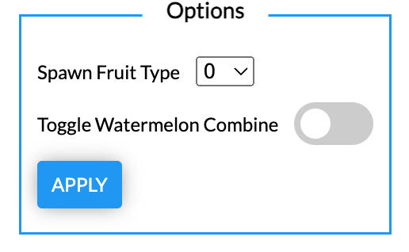

# SuikaGame Modification
 - Used on suikagame.com
 - This Google Chrome Extension replaces the project.js file of suikagame.com during the loading phase of the website replacing the file with a modified version.
 - Allows to choose the next level of fruit to spawn.
 - Toggle the combining of Watermelon fruits.
 - Leaderboards do not work for the entire site currently irrespective of the installation of this extension.
 - Please use for educational purposes :|

    

<h1> Suika Game Modification </h1>

## Installation
 - git clone this repository
 - head to chrome extensions
 - enable developer mode
 - load unpacked extension
 - select the root folder of the clone repository
 - head to suikagame.com